# Sloe Essence Shopify Store - Architectural Document

## Table of Contents
1. [High-Level Application Overview](#high-level-application-overview)
2. [Main Components](#main-components)
3. [Key Data Models](#key-data-models)
4. [Core Workflows](#core-workflows)
5. [Technology Stack](#technology-stack)
6. [Architecture Diagrams](#architecture-diagrams)
7. [Security & Performance](#security--performance)
8. [Deployment & Configuration](#deployment--configuration)

---

## High-Level Application Overview

### Purpose
The Sloe Essence Shopify Store is a modern, AI-powered skincare e-commerce platform built on Shopify 2.0 architecture. The theme is specifically designed for the Sloe Essence brand, focusing on:

- **AI-Powered Skincare Recommendations**: Emphasizing intelligent product suggestions
- **Premium User Experience**: Clean, minimalist design inspired by luxury skincare brands
- **Organic & Natural Branding**: Highlighting the organic sourcing of ingredients
- **Customer Engagement**: Newsletter integration and personalized skincare advice

### Key Features
- Fully customizable through Shopify's theme editor (no code required)
- Mobile-first responsive design
- Performance-optimized with minimal JavaScript
- WCAG 2.1 Level AA accessibility compliance
- Modular section-based architecture (Shopify 2.0)
- SEO-optimized with proper meta tags and semantic HTML

### Business Value
The application serves as the primary digital storefront for Sloe Essence, enabling:
- Direct-to-consumer product sales
- Brand storytelling and customer education
- Customer data collection through newsletter signup
- Product discovery through AI-recommended selections
- Multi-channel marketing integration (social media, email)

---

## Main Components

### 1. Frontend Components

#### **Layout Layer**
- **Theme Layout** (`layout/theme.liquid`): Master template wrapping all pages
- **Password Layout** (`layout/password.liquid`): Pre-launch password protection page

#### **Section Components**
Reusable, customizable sections that can be added/removed via the theme editor:

- **Header** (`sections/header.liquid`): Navigation, logo, search, cart, account access
- **Hero** (`sections/hero.liquid`): Large banner with CTA on homepage
- **Featured Products** (`sections/featured-products.liquid`): Product showcase grid
- **Brand Story** (`sections/brand-story.liquid`): Image + text storytelling section
- **Newsletter** (`sections/newsletter.liquid`): Email capture form
- **Footer** (`sections/footer.liquid`): Multi-column footer with links and social icons
- **Announcement Bar** (`sections/announcement-bar.liquid`): Top banner for promotions

#### **Snippet Components**
Small, reusable UI elements:

- **Icons** (`snippets/icon-*.liquid`): SVG icon library (search, cart, social media, etc.)
- **Social Icons** (`snippets/social-icons.liquid`): Dynamic social media link generator
- **Search Form** (`snippets/search-form.liquid`): Product search interface
- **Meta Tags** (`snippets/meta-tags.liquid`): SEO and social sharing meta tags

#### **Template Layer**
JSON templates defining page structure:

- **Homepage** (`templates/index.json`): Configured with hero, products, brand story, newsletter
- **Page Template** (`templates/page.json`): Standard content pages
- **404 Template** (`templates/404.json`): Error page

### 2. Backend Components

#### **Shopify Platform Services**
The application leverages Shopify's backend infrastructure:

- **Product Management**: Shopify Admin for catalog management
- **Order Processing**: Built-in checkout and payment processing
- **Customer Management**: Customer accounts, authentication, and data storage
- **Cart System**: Session-based shopping cart
- **Search**: Predictive search API
- **CDN**: Shopify's global content delivery network
- **Theme Engine**: Liquid template rendering
- **API Access**: Shopify Storefront API and Ajax API

### 3. Database (Managed by Shopify)

Shopify provides a fully managed database layer storing:

- **Products**: Catalog data, variants, pricing, inventory
- **Collections**: Product groupings and categorizations
- **Customers**: User accounts, addresses, order history
- **Orders**: Transaction records, fulfillment status
- **Pages**: Content pages (About, FAQ, etc.)
- **Navigation**: Menu structures
- **Settings**: Theme configuration data
- **Assets**: Images, files, and media

### 4. External Integrations

#### **Current Integrations**
- **Shopify CDN**: Asset delivery and caching
- **Google Fonts / Shopify Fonts**: Typography service (Assistant font family)
- **Social Media Platforms**: Link integration (Instagram, TikTok, Facebook, Twitter, YouTube)

#### **Potential Future Integrations**
- AI Skincare Analysis Tool (referenced in messaging)
- Email Marketing Platform (Klaviyo, Mailchimp)
- Analytics (Google Analytics, Shopify Analytics)
- Customer Service (Zendesk, Gorgias)
- Payment Gateways (Stripe, PayPal, Shop Pay)

---

## Key Data Models

### Product Model
```typescript
interface Product {
  id: string;                    // Unique identifier
  title: string;                 // Product name
  description: string;           // Full product description
  vendor: string;                // Brand/manufacturer
  product_type: string;          // Category (e.g., "Moisturizer")
  handle: string;                // URL-friendly identifier
  price: number;                 // Base price in cents
  compare_at_price?: number;     // Original price (for sales)
  available: boolean;            // Inventory availability
  featured_media: Media;         // Primary product image
  media: Media[];                // All product images/videos
  variants: ProductVariant[];    // Size, color, etc. variations
  tags: string[];                // Categorization tags
  created_at: DateTime;          // Creation timestamp
  updated_at: DateTime;          // Last modification timestamp
}
```

### ProductVariant Model
```typescript
interface ProductVariant {
  id: string;
  product_id: string;
  title: string;                 // Variant name (e.g., "50ml")
  price: number;
  sku: string;                   // Stock Keeping Unit
  inventory_quantity: number;
  inventory_management: string;  // Shopify tracking
  option1?: string;              // First variant option
  option2?: string;              // Second variant option
  option3?: string;              // Third variant option
  weight: number;
  weight_unit: string;
}
```

### Customer Model
```typescript
interface Customer {
  id: string;
  email: string;
  first_name: string;
  last_name: string;
  phone?: string;
  accepts_marketing: boolean;    // Newsletter consent
  created_at: DateTime;
  updated_at: DateTime;
  addresses: Address[];
  orders: Order[];
  tags: string[];                // Segmentation (e.g., "newsletter")
  state: string;                 // enabled | disabled | invited | declined
}
```

### Order Model
```typescript
interface Order {
  id: string;
  order_number: number;
  customer: Customer;
  line_items: LineItem[];
  subtotal_price: number;
  total_price: number;
  total_tax: number;
  shipping_lines: ShippingLine[];
  billing_address: Address;
  shipping_address: Address;
  financial_status: string;      // paid | pending | refunded
  fulfillment_status: string;    // fulfilled | partial | unfulfilled
  created_at: DateTime;
  cancelled_at?: DateTime;
}
```

### Cart Model
```typescript
interface Cart {
  token: string;                 // Session identifier
  note?: string;                 // Customer notes
  attributes: Record<string, any>;
  items: CartItem[];
  item_count: number;
  total_price: number;
  requires_shipping: boolean;
}

interface CartItem {
  id: string;
  variant_id: string;
  product_id: string;
  title: string;
  quantity: number;
  price: number;
  line_price: number;           // price * quantity
  image: string;
  url: string;
}
```

### Section Settings Model
```typescript
interface SectionSettings {
  id: string;
  type: string;                  // section type identifier
  settings: Record<string, any>; // Custom section settings
  blocks?: Block[];              // Nested content blocks
  block_order?: string[];        // Block sequence
}

interface Block {
  id: string;
  type: string;
  settings: Record<string, any>;
}
```

### Theme Settings Model
```typescript
interface ThemeSettings {
  colors_text: string;           // Primary text color
  colors_background: string;     // Background color
  colors_accent: string;         // Accent/highlight color
  colors_primary: string;        // Brand primary color
  colors_border: string;         // Border color
  type_header_font: string;      // Heading font family
  type_body_font: string;        // Body font family
  heading_scale: number;         // Font size scale (%)
  body_scale: number;            // Font size scale (%)
  page_width: number;            // Max content width (px)
  social_instagram_link?: string;
  social_tiktok_link?: string;
  social_facebook_link?: string;
  social_twitter_link?: string;
  social_youtube_link?: string;
  favicon?: string;              // Favicon image
  logo?: string;                 // Header logo image
  predictive_search_enabled: boolean;
}
```

### Navigation Menu Model
```typescript
interface Menu {
  handle: string;                // Menu identifier (e.g., "main-menu")
  title: string;
  links: MenuLink[];
}

interface MenuLink {
  title: string;
  url: string;
  type: string;                  // http | collection | product | page
  active: boolean;               // Current page indicator
  child_active: boolean;
  current: boolean;
}
```

---

## Core Workflows

### 1. Homepage Rendering Workflow

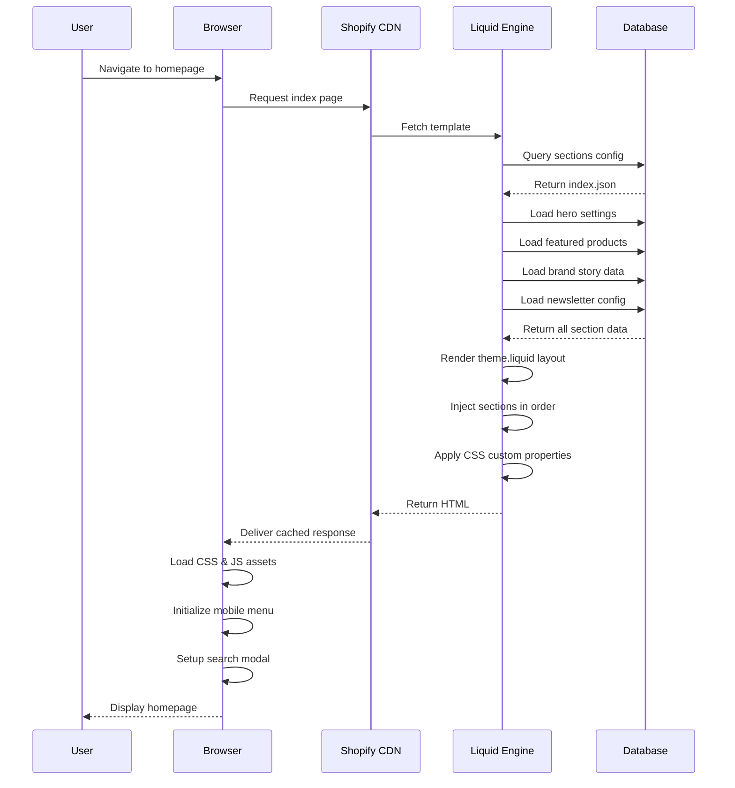

### 2. Product Browsing Workflow

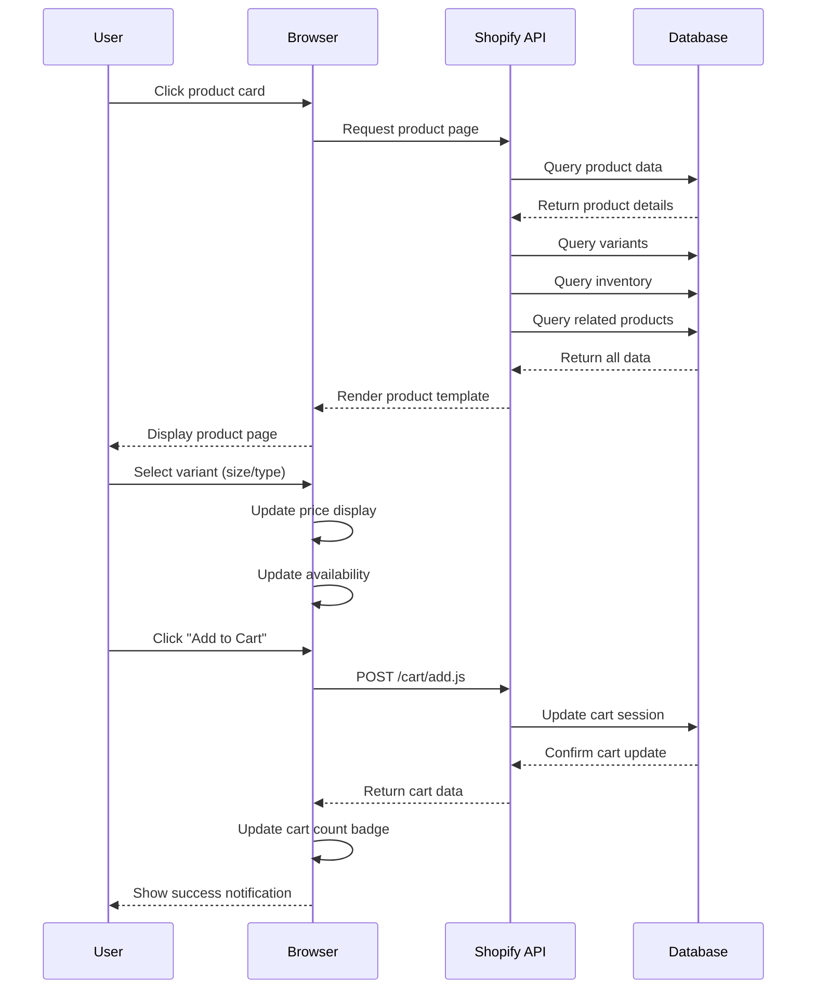

### 3. Newsletter Signup Workflow

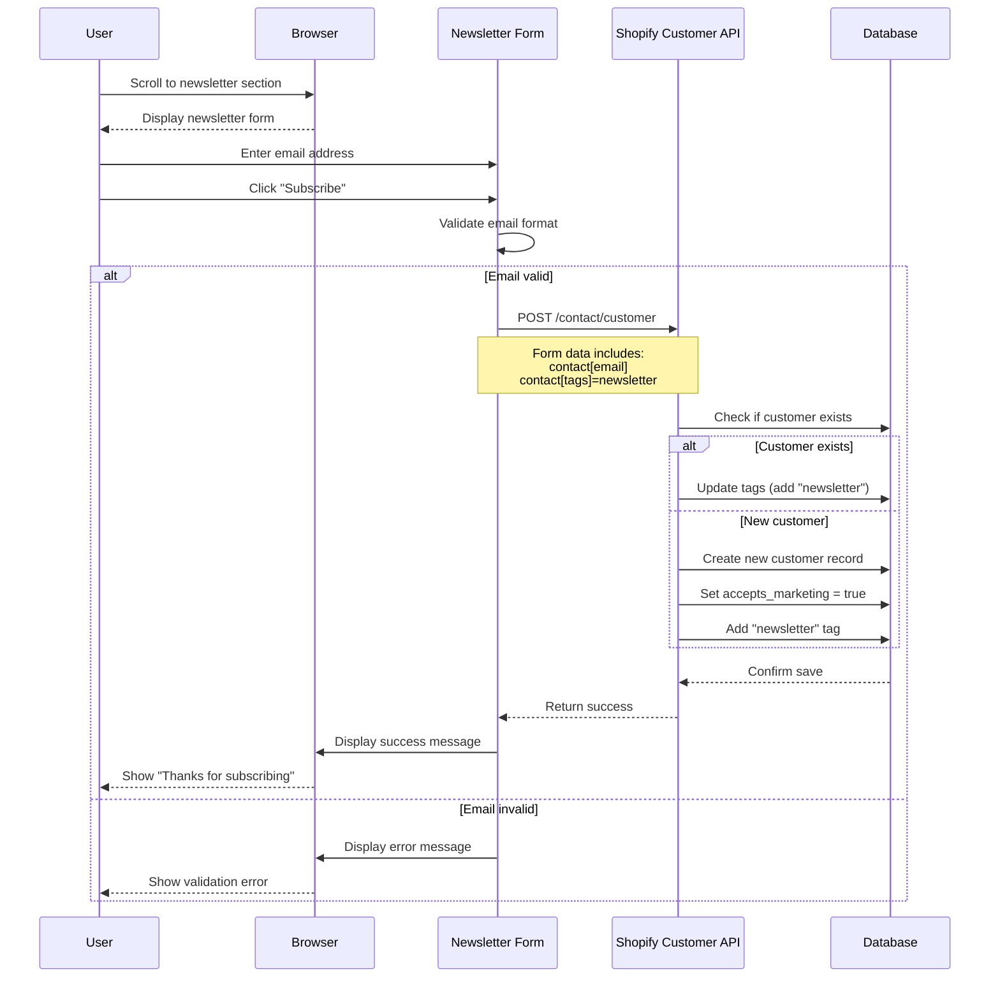

### 4. Search Workflow

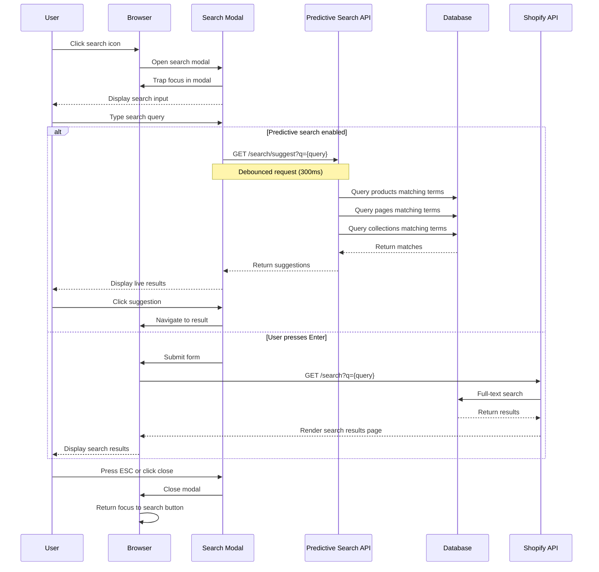

### 5. Checkout Workflow

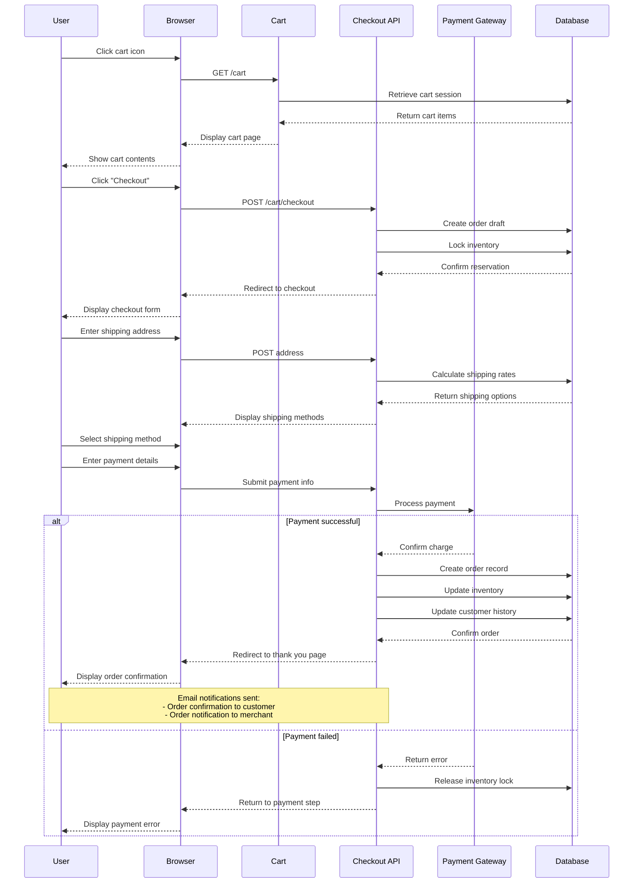

### 6. Theme Customization Workflow

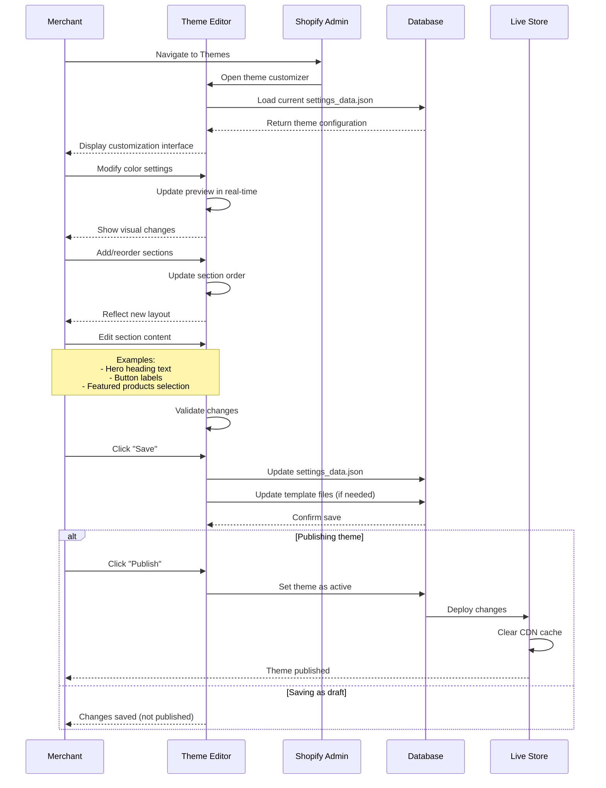

### 7. Mobile Menu Workflow

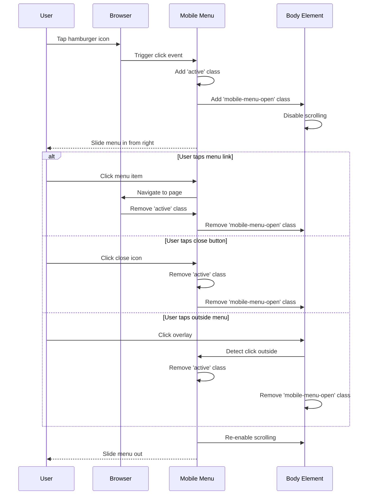

---

## Technology Stack

### Frontend Technologies

#### **Templating & Markup**
- **Liquid** (v5): Shopify's templating language
  - Server-side rendering
  - Dynamic content injection
  - Template inheritance and includes
  - Filters and tags for data manipulation
- **HTML5**: Semantic markup with ARIA attributes
- **JSON**: Template and configuration structure (Shopify 2.0)

#### **Styling**
- **CSS3**: Custom stylesheets
  - CSS Custom Properties (CSS Variables) for theming
  - Grid and Flexbox for layouts
  - Mobile-first responsive design
  - BEM-like naming conventions
- **Modular Architecture**:
  - `base.css`: Reset, typography, utilities
  - `sloe-essence.css`: Theme-specific styles
  - Component CSS files (e.g., `component-header.css`, `component-card.css`)
  - Section CSS files (e.g., `section-hero.css`)

#### **JavaScript**
- **Vanilla JavaScript (ES6+)**: No frameworks required
  - Custom Elements API for web components
  - Event delegation for performance
  - Intersection Observer for lazy loading
  - Async/await for API calls
- **Key Libraries**: None (framework-free approach)
- **Primary Functions**:
  - Mobile menu toggle
  - Modal/details elements
  - Focus trapping for accessibility
  - Search form handling
  - Cart interactions

#### **Assets & Media**
- **SVG Icons**: Inline sprite system for scalability
- **Responsive Images**: Shopify's `image_url` filter with srcset
- **Lazy Loading**: Native loading="lazy" attribute
- **CDN Delivery**: Automatic via Shopify CDN

### Backend Technologies

#### **Platform**
- **Shopify**: Cloud-hosted SaaS e-commerce platform
  - Ruby on Rails-based (abstracted from theme developers)
  - PostgreSQL database (managed)
  - Redis for caching and sessions
  - Multi-tenant architecture

#### **APIs**
- **Shopify Ajax Cart API**: Client-side cart operations
  - `/cart/add.js`: Add items to cart
  - `/cart/change.js`: Update cart quantities
  - `/cart.js`: Retrieve cart state
- **Shopify Storefront API**: GraphQL API for custom storefronts (not currently used but available)
- **Predictive Search API**: `/search/suggest.json`
- **Customer API**: Form submissions for customer creation

#### **Data Storage**
- **Shopify Database**: Managed PostgreSQL
  - Products, variants, inventory
  - Customers, orders, carts
  - Theme settings, content pages
  - Media assets metadata
- **CDN Storage**: Shopify's global CDN
  - Theme assets (CSS, JS, images)
  - Product images
  - Uploaded content

### Development & Deployment

#### **Development Tools**
- **Shopify CLI** (optional): Local development and theme deployment
- **Git**: Version control
- **Theme Kit** (legacy): Alternative deployment tool

#### **Build Process**
- **No build step required**: Theme files deployed as-is
- **Asset minification**: Optional via Shopify or external tools
- **CSS preprocessing**: Not used (vanilla CSS with variables)

#### **Deployment**
- **Manual Upload**: ZIP file upload via Shopify Admin
- **Shopify CLI**: `shopify theme push`
- **GitHub Integration**: Available for automated deployments
- **Staging**: Unpublished themes for testing

### Third-Party Services

#### **Fonts**
- **Shopify Font Library**: Assistant font family
- **Google Fonts**: Alternative font source
- **System Fonts**: Fallback font stack

#### **Analytics** (potential integrations)
- Shopify Analytics (built-in)
- Google Analytics
- Facebook Pixel
- TikTok Pixel

#### **Email Marketing**
- Customer email capture via Shopify Customer API
- Potential integration: Klaviyo, Mailchimp

### Browser Support

#### **Supported Browsers**
- Chrome/Edge (Chromium): Latest 2 versions
- Firefox: Latest 2 versions
- Safari: Latest 2 versions
- Mobile Safari (iOS): Latest 2 versions
- Chrome Mobile (Android): Latest 2 versions

#### **Progressive Enhancement**
- Core functionality works without JavaScript
- Enhanced UX with JavaScript enabled
- Fallbacks for older browsers

---

## Architecture Diagrams

### System Architecture Overview

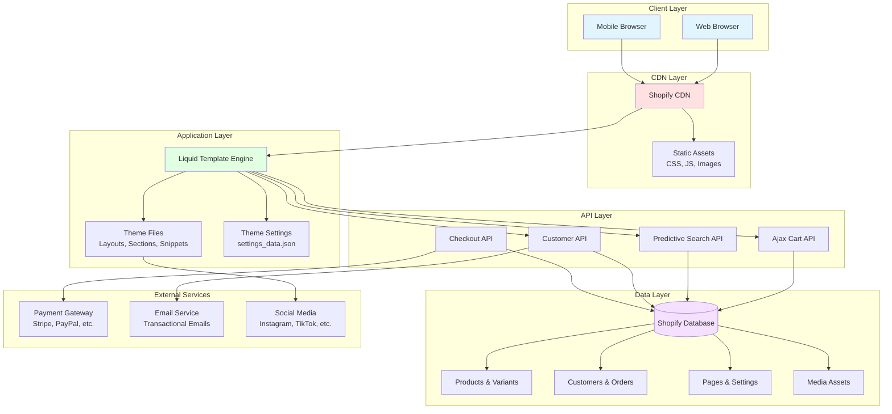

### Component Architecture

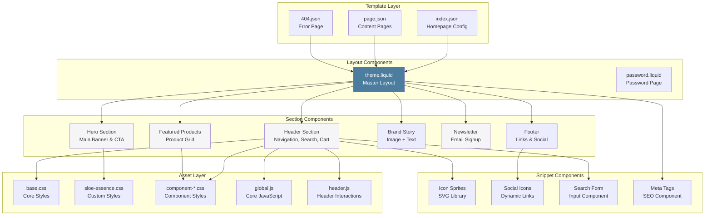

### Data Flow Architecture

```mermaid
flowchart LR
    subgraph "User Actions"
        ViewPage[View Page]
        AddToCart[Add to Cart]
        Search[Search Products]
        Subscribe[Newsletter Signup]
        Checkout[Checkout]
    end
    
    subgraph "Frontend Processing"
        LiquidRender[Liquid Rendering]
        JSHandler[JavaScript Event Handlers]
        FormValidation[Form Validation]
    end
    
    subgraph "API Endpoints"
        CartAPI[/cart/add.js]
        SearchAPI[/search/suggest.json]
        CustomerAPI[/contact/customer]
        CheckoutAPI[/checkout]
    end
    
    subgraph "Backend Processing"
        DataQuery[Database Queries]
        BusinessLogic[Business Logic]
        Validation[Server Validation]
    end
    
    subgraph "Data Storage"
        ProductData[(Product Data)]
        CustomerData[(Customer Data)]
        OrderData[(Order Data)]
        SettingsData[(Settings Data)]
    end
    
    ViewPage --> LiquidRender
    LiquidRender --> DataQuery
    DataQuery --> ProductData
    DataQuery --> SettingsData
    
    AddToCart --> JSHandler
    JSHandler --> CartAPI
    CartAPI --> BusinessLogic
    BusinessLogic --> OrderData
    
    Search --> JSHandler
    JSHandler --> SearchAPI
    SearchAPI --> DataQuery
    DataQuery --> ProductData
    
    Subscribe --> FormValidation
    FormValidation --> CustomerAPI
    CustomerAPI --> Validation
    Validation --> CustomerData
    
    Checkout --> CheckoutAPI
    CheckoutAPI --> BusinessLogic
    BusinessLogic --> OrderData
    BusinessLogic --> CustomerData
    
    style ViewPage fill:#e1f5ff
    style AddToCart fill:#e1f5ff
    style Search fill:#e1f5ff
    style Subscribe fill:#e1f5ff
    style CartAPI fill:#ffe1e1
    style ProductData fill:#f5e1ff
```

### Deployment Architecture

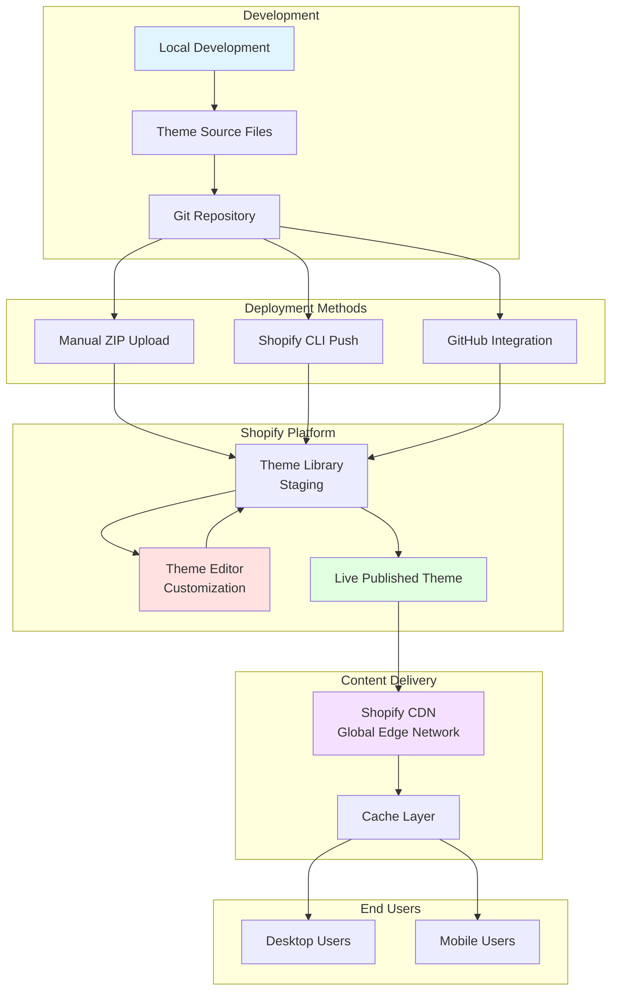

### User Journey Map

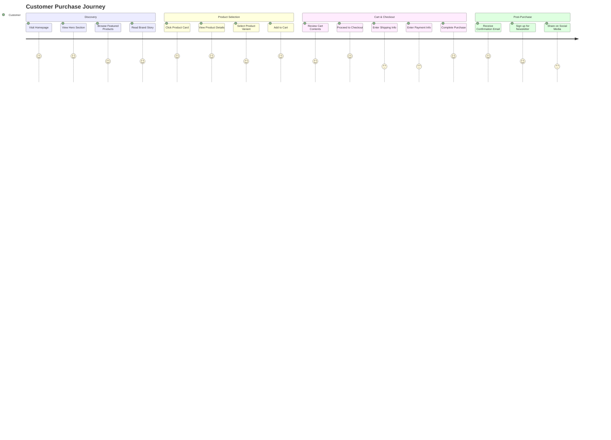

### Section Schema Architecture

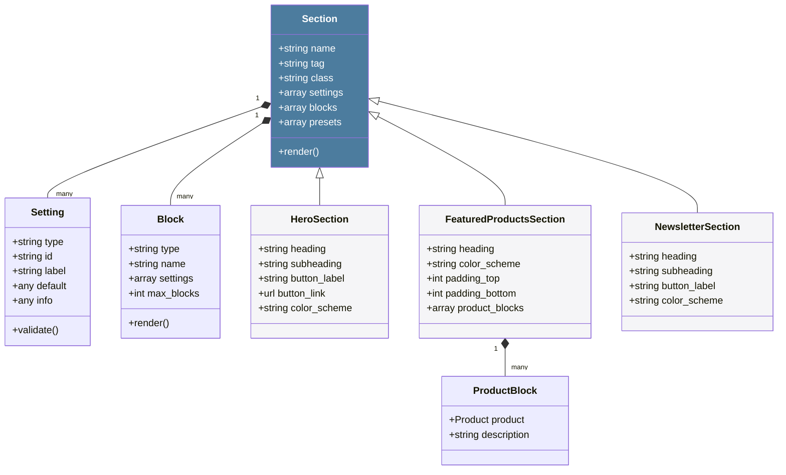

---

## Security & Performance

### Security Measures

#### **Platform-Level Security** (Provided by Shopify)
- **PCI DSS Level 1 Compliance**: Highest security standard for payment processing
- **SSL/TLS Encryption**: All traffic encrypted (HTTPS enforced)
- **DDoS Protection**: Built-in defense against distributed denial of service attacks
- **Regular Security Audits**: Shopify platform undergoes third-party audits
- **Data Encryption**: At-rest and in-transit encryption for sensitive data
- **Automatic Security Updates**: Platform patches applied without merchant action

#### **Application-Level Security**
- **XSS Prevention**: Liquid's automatic HTML escaping (using `| escape` filter)
- **CSRF Protection**: Built into Shopify forms (authenticity tokens)
- **Input Validation**: Form validation on both client and server side
- **Content Security Policy**: Recommended headers for iframe protection
- **No Sensitive Data in Frontend**: API keys and secrets managed server-side

#### **Authentication & Authorization**
- **Customer Authentication**: Shopify's built-in customer accounts
- **Password Requirements**: Enforced minimum strength
- **Session Management**: Secure cookie-based sessions
- **Multi-Factor Authentication**: Available for admin accounts
- **Role-Based Access**: Admin permissions for store management

### Performance Optimization

#### **Frontend Performance**
- **Minimal JavaScript**: < 10KB of custom JS
  - No heavy frameworks (React, Vue, etc.)
  - Native APIs for all interactions
  - Deferred script loading
- **Efficient CSS**: Modular, component-scoped styles
  - No CSS frameworks (Bootstrap, Tailwind)
  - Critical CSS inlined in `<head>`
  - Non-critical CSS loaded asynchronously
- **Image Optimization**:
  - Responsive images with srcset
  - Lazy loading for below-the-fold images
  - WebP format support (automatic via Shopify)
  - Proper sizing (multiple variants: 165w, 360w, 533w, 720w, 940w, 1066w)

#### **Caching Strategy**
- **CDN Caching**: Shopify's global CDN (120+ edge locations)
  - Static assets cached at edge
  - Cache invalidation on theme updates
- **Browser Caching**: HTTP cache headers for assets
- **Session Caching**: Cart and customer data cached in Redis

#### **Database Query Optimization**
- **Liquid Optimization**:
  - Limit queries with `limit` parameter
  - Use `product.featured_media` instead of looping all media
  - Minimize nested loops
- **Pagination**: For collections and search results
- **Indexed Queries**: Shopify's database has optimized indexes

#### **Asset Delivery**
- **HTTP/2**: Enabled by default on Shopify CDN
- **Gzip Compression**: Automatic for text assets
- **Asset Concatenation**: Minimized HTTP requests
- **Font Optimization**: Variable fonts where possible, font-display: swap

#### **Performance Metrics** (Target Goals)
- **First Contentful Paint (FCP)**: < 1.5s
- **Largest Contentful Paint (LCP)**: < 2.5s
- **Time to Interactive (TTI)**: < 3.5s
- **Cumulative Layout Shift (CLS)**: < 0.1
- **First Input Delay (FID)**: < 100ms

### Accessibility (WCAG 2.1 Level AA)

#### **Semantic HTML**
- Proper heading hierarchy (H1 → H2 → H3)
- Landmark regions (`<header>`, `<nav>`, `<main>`, `<footer>`)
- Descriptive link text (no "click here")
- Form labels associated with inputs

#### **ARIA Attributes**
- `aria-label` for icon-only buttons
- `aria-describedby` for form errors
- `aria-current="page"` for active navigation
- `aria-haspopup` for modals and dropdowns
- `aria-modal="true"` for dialog elements

#### **Keyboard Navigation**
- All interactive elements focusable
- Logical tab order
- Focus trapping in modals
- ESC key to close modals
- Skip to main content link

#### **Color Contrast**
- Text contrast ratio ≥ 4.5:1 (normal text)
- Text contrast ratio ≥ 3:1 (large text)
- Non-text contrast ≥ 3:1 (UI components)

#### **Screen Reader Support**
- `visually-hidden` class for screen reader-only text
- Descriptive alt text for images
- Form error announcements
- Loading states communicated

---

## Deployment & Configuration

### Deployment Process

#### **Method 1: Manual Upload (Recommended for Non-Developers)**
1. **Prepare Theme Package**:
   - Ensure all required directories exist: `assets/`, `config/`, `layout/`, `locales/`, `sections/`, `snippets/`, `templates/`
   - Create a ZIP file with folders at root level (not nested in a parent folder)

2. **Upload to Shopify**:
   - Navigate to: Shopify Admin → Online Store → Themes
   - Click "Add theme" → "Upload zip file"
   - Select the theme ZIP file
   - Wait for upload and processing

3. **Customize & Test**:
   - Click "Customize" on the uploaded theme
   - Configure settings in the theme editor
   - Preview on desktop and mobile
   - Test all interactive elements

4. **Publish**:
   - Click "Publish" to make it the live theme
   - Or save as unpublished for staging

#### **Method 2: Shopify CLI (Recommended for Developers)**
```bash
# Install Shopify CLI
npm install -g @shopify/cli @shopify/theme

# Navigate to theme directory
cd /path/to/sloe-essence-theme

# Authenticate with Shopify
shopify login --store your-store.myshopify.com

# Push theme to Shopify
shopify theme push

# Or serve for local development with hot reloading
shopify theme dev --store your-store.myshopify.com
```

#### **Method 3: GitHub Integration**
1. Connect GitHub repository to Shopify
2. Set up automatic deployments on push to main branch
3. Configure branch for theme syncing

### Configuration Steps

#### **1. Theme Settings Configuration**
Navigate to: Theme Customizer → Theme Settings

**Colors**:
- Text: `#1D1D1F` (Dark gray)
- Background: `#FFFFFF` (White)
- Accent: `#F5F5F7` (Light gray)
- Primary: `#4C7C9E` (Blue-gray brand color)
- Border: `#E5E5E7` (Light border)

**Typography**:
- Heading Font: Assistant (or custom choice)
- Body Font: Assistant (or custom choice)
- Heading Scale: 100%
- Body Scale: 100%

**Layout**:
- Page Width: 1200px (adjustable: 1000px - 1600px)

**Social Media Links**:
- Instagram: `https://instagram.com/sloeessence`
- TikTok: `https://tiktok.com/@sloeessence`
- Facebook: `https://facebook.com/sloeessence`
- Twitter: `https://twitter.com/sloeessence`
- YouTube: `https://youtube.com/sloeessence`

**Favicon**:
- Upload square image (recommended: 512x512px PNG)
- Shopify scales to 32x32px

**Search**:
- Enable Predictive Search: ✓ (recommended)

#### **2. Navigation Menu Configuration**
Navigate to: Shopify Admin → Online Store → Navigation

**Main Menu** (Header Navigation):
```
- Shop → /collections/all
- The Sloe App → /pages/app
- Our Story → /pages/about
- Contact → /pages/contact
```

**Footer Menus**:
- Footer Menu 1 (Shop): Products, Collections, New Arrivals
- Footer Menu 2 (Learn): About Us, Blog, Ingredients
- Footer Menu 3 (Help): FAQ, Shipping, Returns, Contact

#### **3. Homepage Section Configuration**
Navigate to: Theme Customizer → Homepage

**Announcement Bar** (optional):
- Enable/disable
- Message: "Free shipping on orders over $50"
- Link: `/pages/shipping`

**Header**:
- Upload logo image
- Logo width: 100px (adjustable)
- Select main menu

**Hero Section**:
- Heading: "AI-Powered Skincare. Organically Sourced."
- Subheading: "Stop guessing. Let our AI analyze your skin and build the perfect routine for you."
- Button Label: "Discover Your Routine"
- Button Link: `/collections/all` or `/pages/quiz`
- Color Scheme: Background

**Featured Products**:
- Heading: "Our AI-Recommended Bestsellers"
- Add 3-6 product blocks
- For each block:
  - Select product from catalog
  - Add short description
- Color Scheme: Accent
- Padding Top: 80px
- Padding Bottom: 80px

**Brand Story**:
- Upload image (recommended: 1200x900px, landscape)
- Image Position: Left or Right
- Heading: "Expert Skincare. For Everyone."
- Text: Brand story paragraph (supports rich text)
- Button Label: "Learn Our Mission"
- Button Link: `/pages/about`
- Color Scheme: Background
- Padding Top: 96px
- Padding Bottom: 96px

**Newsletter**:
- Heading: "Get Smarter Skin Tips (and 10% Off)"
- Subheading: "Join our list to get 10% off your first order, plus personalized advice..."
- Button Label: "Subscribe"
- Color Scheme: Primary
- Padding Top: 80px
- Padding Bottom: 80px

**Footer**:
- Color Scheme: Dark (text)
- Add 4 blocks:
  - Link List (Shop menu)
  - Link List (Learn menu)
  - Link List (Help menu)
  - Social Media icons

#### **4. Content Pages Setup**
Navigate to: Shopify Admin → Online Store → Pages

Create the following pages:
- **About Us** (`/pages/about`): Brand story, mission, values
- **The Sloe App** (`/pages/app`): AI skincare tool information
- **FAQ** (`/pages/faq`): Frequently asked questions
- **Contact** (`/pages/contact`): Contact form, email, social links
- **Shipping & Returns** (`/pages/shipping`): Policies
- **Terms of Service** (`/pages/terms`)
- **Privacy Policy** (`/pages/privacy`)

Assign all pages to the `page.json` template.

#### **5. Product Setup**
Navigate to: Shopify Admin → Products

For each product:
- Add high-quality product images (1000x1000px minimum)
- Write detailed product descriptions
- Set pricing and SKUs
- Configure variants (size, type, etc.)
- Set inventory tracking
- Assign to collections
- Add tags for organization and filtering

### Environment Variables & Settings

#### **Liquid Variables** (Set in theme editor)
```liquid
settings.colors_text          # Text color
settings.colors_background    # Background color
settings.colors_accent        # Accent color
settings.colors_primary       # Primary brand color
settings.type_header_font     # Heading font
settings.type_body_font       # Body font
settings.page_width           # Max content width
settings.social_*_link        # Social media URLs
settings.logo                 # Header logo image
settings.favicon              # Favicon image
```

#### **Routes** (Shopify-managed)
```javascript
routes.root_url               // Homepage
routes.cart_url               // /cart
routes.cart_add_url           // /cart/add
routes.account_url            // /account
routes.search_url             // /search
routes.predictive_search_url  // /search/suggest.json
```

### Testing Checklist

#### **Functional Testing**
- [ ] All navigation links work
- [ ] Mobile menu opens/closes correctly
- [ ] Search functionality works (desktop and mobile)
- [ ] Product cards display correctly
- [ ] "Add to Cart" button functions
- [ ] Cart count updates when items added
- [ ] Newsletter signup creates customer record
- [ ] Form validation displays errors correctly
- [ ] Social media icons link to correct profiles
- [ ] 404 page displays for invalid URLs

#### **Visual Testing**
- [ ] Colors match brand guidelines
- [ ] Fonts load correctly
- [ ] Images display with proper aspect ratios
- [ ] Layout doesn't break on mobile (320px width minimum)
- [ ] Layout doesn't break on desktop (up to 2560px width)
- [ ] No horizontal scrolling on mobile
- [ ] Spacing and padding consistent across sections

#### **Performance Testing**
- [ ] Page load time < 3 seconds
- [ ] Lighthouse score > 90 (Performance)
- [ ] Images lazy load below fold
- [ ] No console errors in browser developer tools
- [ ] Assets load from CDN
- [ ] Gzip compression enabled

#### **Accessibility Testing**
- [ ] Keyboard navigation works (Tab, Enter, Esc)
- [ ] Focus indicators visible
- [ ] Screen reader announces content correctly (test with NVDA/JAWS)
- [ ] Color contrast passes WCAG AA (use WebAIM contrast checker)
- [ ] Form errors announced to screen readers
- [ ] Skip to content link works

#### **Cross-Browser Testing**
- [ ] Chrome (latest)
- [ ] Firefox (latest)
- [ ] Safari (latest)
- [ ] Edge (latest)
- [ ] Mobile Safari (iOS)
- [ ] Chrome Mobile (Android)

#### **E-commerce Testing**
- [ ] Products display with correct prices
- [ ] Variants can be selected
- [ ] Cart totals calculate correctly
- [ ] Checkout process completes
- [ ] Order confirmation email sends
- [ ] Customer account creation works
- [ ] Newsletter subscription adds "newsletter" tag

### Monitoring & Maintenance

#### **Performance Monitoring**
- Shopify Analytics (built-in): Track sales, traffic, conversion rate
- Google Analytics: Optional integration for detailed insights
- Shopify Online Store Speed Report: Track page load times

#### **Error Monitoring**
- Browser console errors: Check regularly in developer tools
- Shopify theme check: Run `shopify theme check` for code quality
- Customer feedback: Monitor for reported issues

#### **Regular Maintenance Tasks**
- **Weekly**:
  - Check for broken links
  - Review analytics for performance issues
  - Test checkout process
  
- **Monthly**:
  - Update product images and descriptions
  - Review and optimize slow-loading pages
  - Check for Shopify platform updates
  
- **Quarterly**:
  - Conduct full accessibility audit
  - Review and update SEO meta tags
  - Test on new browser versions
  - Backup theme files to Git repository

### Troubleshooting Common Issues

#### **Theme Won't Upload**
- **Issue**: ZIP file rejected
- **Solutions**:
  - Ensure ZIP contains folders at root level (not nested)
  - Check file size < 50MB
  - Verify all required folders present (assets, config, layout, locales, sections, snippets, templates)

#### **Sections Not Appearing**
- **Issue**: Customizer doesn't show sections
- **Solutions**:
  - Check section schema is valid JSON
  - Ensure section file is in `sections/` directory
  - Refresh theme editor
  - Re-upload theme if necessary

#### **Products Not Displaying**
- **Issue**: Featured products section shows placeholders
- **Solutions**:
  - Verify products are published (not draft)
  - Select products in section settings
  - Check product availability settings
  - Ensure product has at least one image

#### **Newsletter Signup Not Working**
- **Issue**: Form submission doesn't create customer
- **Solutions**:
  - Check form action is `customer` (Shopify form type)
  - Verify `contact[tags]` hidden input includes "newsletter"
  - Ensure email field has `name="contact[email]"`
  - Check customer accounts are enabled in Shopify settings

#### **Mobile Menu Not Opening**
- **Issue**: Hamburger icon click does nothing
- **Solutions**:
  - Verify `global.js` is loading (check Network tab)
  - Check for JavaScript console errors
  - Ensure mobile menu HTML has correct ID (`mobile-menu`)
  - Verify button has class `mobile-menu-toggle`

---

## Appendix

### File Structure Reference

```
sloe-essence-shopify-store/
│
├── assets/                      # Static assets (CSS, JS, images)
│   ├── base.css                 # Core styles, reset, typography
│   ├── sloe-essence.css         # Theme-specific custom styles
│   ├── global.js                # Core JavaScript functionality
│   ├── header.js                # Header-specific interactions
│   ├── component-*.css          # Component-scoped styles
│   └── section-*.css            # Section-scoped styles
│
├── config/                      # Theme configuration
│   ├── settings_schema.json    # Theme settings definitions
│   └── settings_data.json      # Current theme settings values
│
├── layout/                      # Master templates
│   ├── theme.liquid            # Main layout (wraps all pages)
│   └── password.liquid         # Password protection page
│
├── locales/                     # Translations and text strings
│   ├── en.default.json         # English language strings
│   └── en.default.schema.json  # Schema translations
│
├── sections/                    # Reusable page sections
│   ├── header.liquid           # Site header with navigation
│   ├── footer.liquid           # Site footer
│   ├── hero.liquid             # Hero banner section
│   ├── featured-products.liquid # Product showcase grid
│   ├── brand-story.liquid      # Image + text storytelling
│   ├── newsletter.liquid       # Email signup form
│   ├── announcement-bar.liquid # Top promotional banner
│   ├── main-page.liquid        # Standard page content
│   ├── main-404.liquid         # 404 error page content
│   ├── header-group.json       # Header section group
│   └── footer-group.json       # Footer section group
│
├── snippets/                    # Reusable code fragments
│   ├── icon-*.liquid           # Individual SVG icons
│   ├── icon-sprite.liquid      # SVG sprite sheet
│   ├── social-icons.liquid     # Social media icon links
│   ├── search-form.liquid      # Search input component
│   └── meta-tags.liquid        # SEO and Open Graph tags
│
├── templates/                   # Page templates (JSON)
│   ├── index.json              # Homepage template
│   ├── page.json               # Standard content page
│   └── 404.json                # Error page template
│
├── README.md                    # Theme documentation
└── INSTALLATION.md              # Installation instructions
```

### Key Liquid Tags & Filters Reference

#### **Common Liquid Tags**
```liquid
                     # Inline Liquid code block
               # Conditional logic
     # Loop through items
      # Include snippet
     # Include section
      # Include section group
           # Create Shopify form
                      # Inline CSS block
                     # Section configuration JSON
```

#### **Common Liquid Filters**
```liquid
{{ product.price | money }}      # Format price as currency
{{ image | image_url: width: 500 }} # Generate image URL
{{ text | escape }}              # HTML escape for XSS prevention
{{ date | date: "%Y" }}          # Format date
{{ 'key' | t }}                  # Translate string from locale
{{ text | newline_to_br }}       # Convert newlines to <br>
{{ url | asset_url }}            # Generate asset URL
{{ text | strip_html }}          # Remove HTML tags
```

#### **Shopify Objects**
```liquid
{{ shop.name }}                  # Store name
{{ cart.item_count }}            # Number of cart items
{{ customer.first_name }}        # Logged-in customer name
{{ product.title }}              # Product name
{{ routes.cart_url }}            # Cart page URL
{{ settings.colors_text }}       # Theme setting value
{{ section.settings.heading }}   # Section setting value
{{ block.settings.product }}     # Block setting value
```

### CSS Custom Properties Reference

```css
/* Typography */
--font-body-family: Assistant, sans-serif;
--font-heading-family: Assistant, sans-serif;
--font-body-scale: 1.0;
--font-heading-scale: 1.0;

/* Colors (RGB values) */
--color-base-text: 29, 29, 31;          /* #1D1D1F */
--color-base-background: 255, 255, 255; /* #FFFFFF */
--color-base-accent: 245, 245, 247;     /* #F5F5F7 */
--color-primary: 76, 124, 158;          /* #4C7C9E */
--color-border: 229, 229, 231;          /* #E5E5E7 */

/* Layout */
--page-width: 120rem;                   /* 1200px */
--page-width-margin: 0rem;

/* Usage Example */
.my-element {
  color: rgb(var(--color-base-text));
  background: rgb(var(--color-base-background));
  max-width: var(--page-width);
}
```

### JavaScript API Reference

#### **Shopify Ajax Cart API**
```javascript
// Add item to cart
fetch('/cart/add.js', {
  method: 'POST',
  headers: { 'Content-Type': 'application/json' },
  body: JSON.stringify({
    id: variantId,
    quantity: 1
  })
})
.then(response => response.json())
.then(data => console.log(data));

// Get cart contents
fetch('/cart.js')
  .then(response => response.json())
  .then(cart => console.log(cart));

// Update cart item quantity
fetch('/cart/change.js', {
  method: 'POST',
  headers: { 'Content-Type': 'application/json' },
  body: JSON.stringify({
    id: lineItemKey,
    quantity: 2
  })
})
.then(response => response.json())
.then(data => console.log(data));
```

#### **Predictive Search API**
```javascript
// Search for products
const query = 'moisturizer';
fetch(`/search/suggest.json?q=${query}&resources[type]=product`)
  .then(response => response.json())
  .then(results => console.log(results.resources.results.products));
```

### Shopify CLI Commands

```bash
# Authentication
shopify login --store your-store.myshopify.com
shopify logout

# Theme Management
shopify theme push                # Upload theme to Shopify
shopify theme pull                # Download theme from Shopify
shopify theme dev                 # Local development server
shopify theme check               # Lint theme files
shopify theme list                # List all themes in store
shopify theme publish             # Set theme as live

# Development
shopify theme dev --store your-store.myshopify.com --theme-editor-sync
# Starts local server with hot reloading and theme editor sync
```

### Version History

| Version | Date       | Changes                                    |
|---------|------------|--------------------------------------------|
| 1.0.0   | 2025-01-XX | Initial theme release                      |
|         |            | - Shopify 2.0 architecture                 |
|         |            | - Core sections (hero, products, etc.)     |
|         |            | - Mobile-responsive design                 |
|         |            | - Accessibility compliance (WCAG 2.1 AA)   |
|         |            | - Newsletter integration                   |
|         |            | - Social media integration                 |

### Contact & Support

**Developer Support**:
- Shopify Theme Documentation: https://shopify.dev/themes
- Liquid Reference: https://shopify.dev/api/liquid
- Shopify Community Forums: https://community.shopify.com/

**Theme Support**:
- For theme-specific questions, refer to README.md and INSTALLATION.md
- For Shopify platform issues, contact Shopify Support

---

**Document Version**: 1.0.0  
**Last Updated**: November 17, 2025  
**Author**: Senior Software Architect  
**Project**: Sloe Essence Shopify Store

